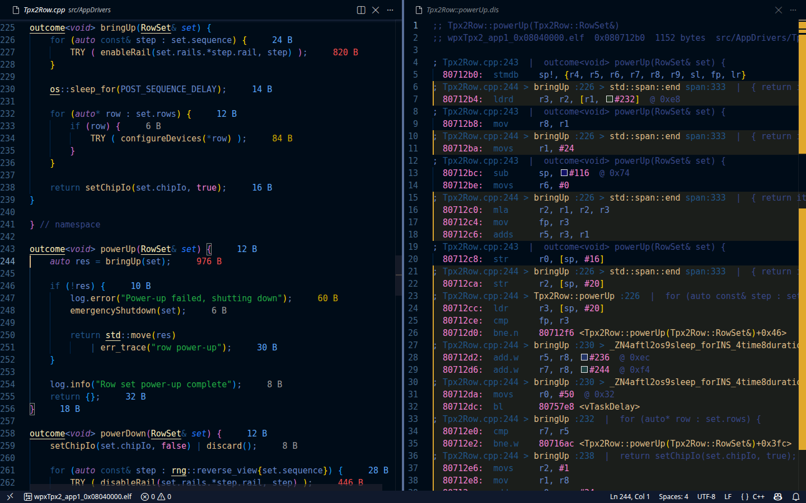
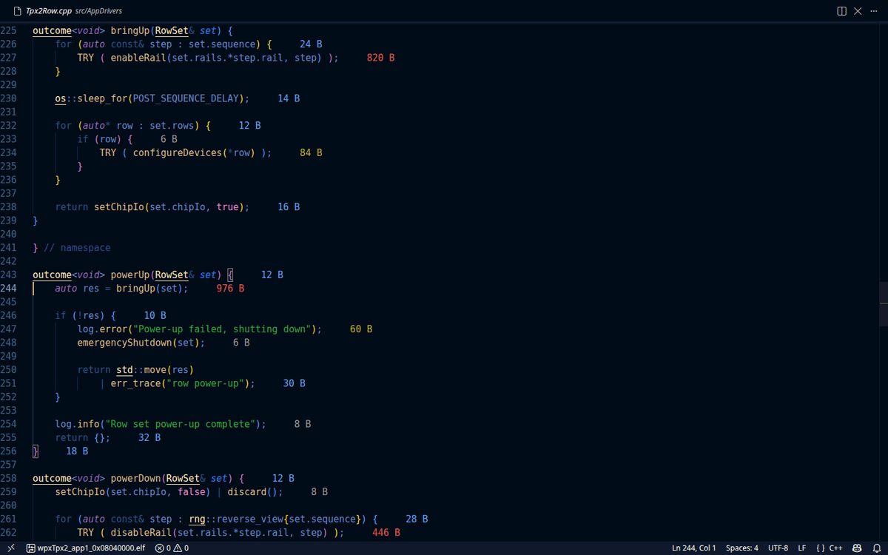

# Istari

Source-to-assembly navigation over a linked ELF, inside VS Code.





Istari reads the ELF you actually flash, with the inlining and dead-stripping
the linker settled, and puts the result next to your source:

- Per-function listings. Each function opens as its own read-only document,
  named after the function. Every run of instructions is headed by a marker
  that names the source line and, for inlined code, the chain of call sites
  that pulled it in, outermost first:

  ```
  ; Tpx2Row.cpp:244 > bringUp :226 > std::span::end span:333  |  return _M_ptr + size();
    8070ff8:  ldrd     r3, r2, [r1, #232]  @ 0xe8
  ```

- Byte costs in the source. Every line that produced code shows how many
  bytes it is responsible for, inclusive of code inlined through it. Hover
  for the exclusive count and the per-function split.
- Cursor following. The editor holding the cursor leads: a source cursor
  marks the instructions it produced in every visible listing, a listing
  cursor marks the source line it came from.
- Branch targets are definitions. Ctrl+click a `bl 8075518 <vTaskDelay>`
  operand to open that function's listing at the target.
- Built-in cheat sheet. Hover a mnemonic for what the instruction does and
  what its suffixes mean; hover a register for its calling-convention role.
  "Istari: Open Instruction Cheat Sheet" renders the whole table. ARM
  Thumb-2 (Cortex-M) is covered.

## Install

From the VS Code Marketplace once it is listed there, or from a release:

```
code --install-extension istari-0.1.0.vsix
```

## Requirements

GNU binutils for the target on PATH: `arm-none-eabi-objdump` for ARM images,
`riscv-none-elf-objdump` for RISC-V, `objdump` for the host. Set
`istari.objdump` to use another. nm and c++filt are taken from beside it.

The ELF needs line tables (`-g` or better). Inline chains and inclusive costs
need the inlining information GCC emits at `-g2` and above.

## Commands

| Command | Default key | Effect |
| --- | --- | --- |
| Istari: Show Assembly / Source for Cursor | Ctrl+Alt+A | Source line to its listing, listing line to its source. A line compiled into several functions asks which. |
| Istari: Open Function Listing | | Pick any function, largest first. |
| Istari: Select ELF Image | | Pick among the workspace's .elf files; the status bar item does the same. |
| Istari: Reload Image | | Re-read the current ELF. It also reloads by itself when the file changes. |
| Istari: Open Instruction Cheat Sheet | | The instruction and register reference for the image's architecture, as a markdown preview. |

## Settings

| Setting | Default | Meaning |
| --- | --- | --- |
| `istari.image` | `""` | ELF to load. Empty: the single .elf in the workspace, or a pick when there are several. A pick is remembered per workspace. |
| `istari.objdump` | `""` | objdump to run. Empty: chosen from the ELF machine type. |
| `istari.costs` | `inclusive` | `inclusive`, `exclusive`, or `off`. |
| `istari.listing.sourceText` | `true` | Append the source line text to listing markers. |

## Development

```
pnpm install
pnpm run compile
pnpm run test:unit        # parser and model, plus the WPX image when present
xvfb-run -a pnpm test     # extension host against the WPX workspace
```

The README images come from `scripts/readme-media.sh`, which drives the
extension in a headless VS Code on the same workspace and needs xvfb-run,
ImageMagick, ffmpeg and xdotool.

Live testing: run the "Istari on WPX" launch configuration (F5), or from a
shell:

```
code --extensionDevelopmentPath=$PWD ~/projects/advacam/src/WPX_CPU_APP-mc-devel
```

Then in the development window: pick `build/wpxTpx2_app1_0x08040000.elf`
from the status bar item, open a source file, press Ctrl+Alt+A. After a
code change, `pnpm run compile` and "Developer: Reload Window" there.
